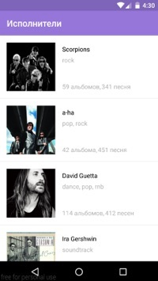

### YandexMobile
#### Mобильное приложение для участия в "Школе мобильной разработки Яндекса".

* [Школа мобильной разработки Яндекса](https://academy.yandex.ru/events/mobdev/msk-2016/)
* [Видео-пример приложения на youtube](https://youtu.be/Nw6LIPPHQOo)

Использованные библиотеки:
*  Robospice
*  Retrofit
*  Picasso
*  Gson
*  Okhttp
*  Junit

