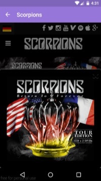
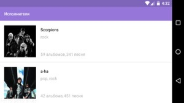

### YandexMobile
#### Mобильное приложение для участия в "Школе мобильной разработки Яндекса".

* [Школа мобильной разработки Яндекса](https://academy.yandex.ru/events/mobdev/msk-2016/)
* [Видео-пример приложения на youtube](https://youtu.be/Nw6LIPPHQOo)
* [Ссылка на приложение dropbox (.apk)](https://www.dropbox.com/s/eht0d7dsb6i8cbu/app-release.apk?dl=0)
* [Ссылка на приложение Google driver (.apk)](https://drive.google.com/open?id=0Bwh9YVconEXCVC1HeEowSFhnX3c)

Использованные библиотеки:
*  Robospice
*  Retrofit
*  Picasso
*  Gson
*  Okhttp
*  Junit

